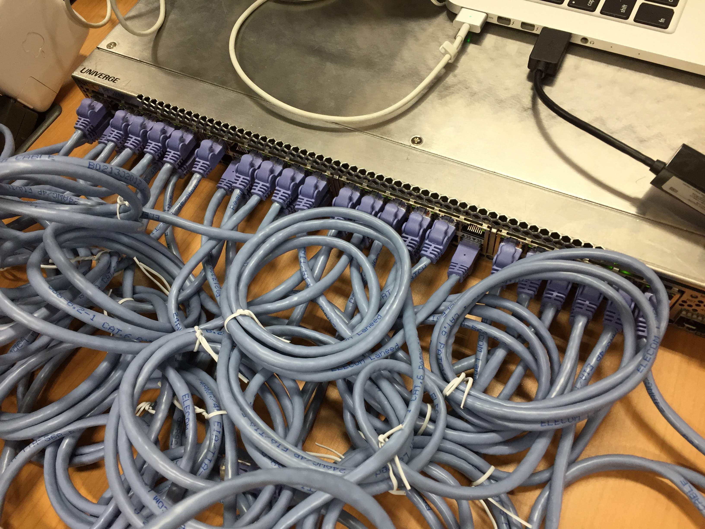

# 第6回 (11/9)レポート1(team-amn:東野研)
## メンバー
* 今井 友揮
* 成元 椋祐
* 西村 友佑
* 原 佑輔
* 三浦 太樹

## グループ課題1: 実機でトポロジを動かそう
### 0. 課題内容
>1. 実機スイッチ上に VSI x16 を作成 (各VSIは2ポート以上)
>2. 全ポートを適当にケーブリング
>3. Topologyを使ってトポロジを表示
>4. ケーブルを抜き差ししてトポロジ画像が更新されることを確認
>
>レポートには次のことを書いてください。
>
>* 表示できたトポロジ画像。何パターンかあると良いです
>* ケーブルを抜き差ししたときの画像
>* 実機スイッチのセットアップ情報。作業中の写真なども入れるとグーです

### 1. VSIの作成
実機スイッチ上にVSIを16個作成し、各VSIに実機のポートを以下の表に示すようにマッピングした．

|VLAN id|VSIのdpid|実機のポート番号|
|:-:|:-:|:-:|
|3|0x1|1〜3|
|6|0x2|4〜6|
|9|0x3|7〜9|
||(中略)||
|42|0xe|40〜42|
|45|0xf|43〜45|
|48|0x10|46〜48|
### 2. 全ポートへのケーブリング
実機スイッチのVSIに対して配布された全てのイーサネットケーブル接続した．


### 3. Topologyを用いたトポロジの表示とケーブルの抜き差し
1. 実機に対し適当にケーブリングをした上で、以下のコマンドを実行した．
```
./bin/trema run ./lib/topology_controller.rb -- graphviz ./graphs/1-1.png
```
実行結果は以下の用になった．


1. 上記のトポロジ図が表示された状態から、VSI:0x1と0x3を結ぶイーサネットケーブルを抜くと、トポロジ図は以下のものに更新された．

