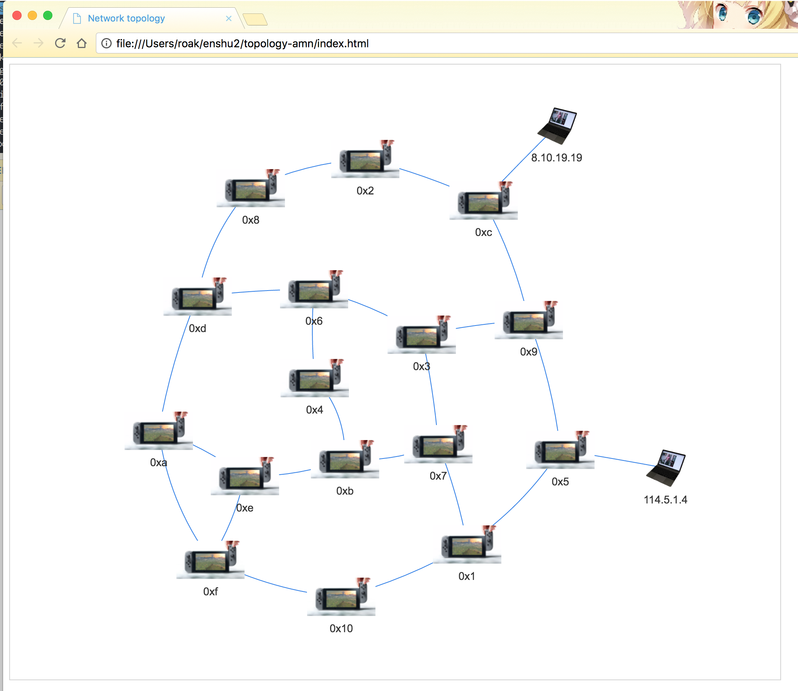

# 第6回 (11/9)レポート2(team-amn:東野研)
## メンバー
* 今井 友揮
* 成元 椋祐
* 西村 友佑
* 原 佑輔
* 三浦 太樹

## グループ課題2: トポロジコントローラの拡張
### 0. 課題内容
>* スイッチの接続関係に加えて、ホストの接続関係を表示する
>* ブラウザで表示する機能を追加する。おすすめは [vis.js](https://github.com/almende/vis) です

### 1. ホストの接続関係の表示
#### 1.1 実装内容
`/lib/view/graphviz.rb`のコードに、
`/lib/topology.rb`のインスタンス変数`@host`の内容を取得し、出力に書き加える処理を追加することで、ホストの接続関係を表示させた．
`/lib/view/graphviz.rb`に追加したコードの内容は以下の通り．
```ruby
#added (2016.11.9) add ellipse with ip_address and link between host and switch
topology.hosts.each do |each|  #for all host
  host = gviz.add_nodes(each[1].to_s, shape: 'ellipse')  #add ellipse with ip_address(each[1])
  gviz.add_edges host, nodes[each[2]]  #add link between host and switch(each[2]:switch dpid)
end
```
#### 1.2 実行結果
`/triangle.conf`に以下のようにホストの設定を加え、tremaを実行してトポロジ画像を表示させた．
```
vswitch { dpid '0x1' }
vswitch { dpid '0x2' }
vswitch { dpid '0x3' }

vhost { ip '192.168.1.1'}
vhost { ip '192.168.1.2'}
vhost { ip '192.168.1.3'}

link '0x1', '0x2'
link '0x1', '0x3'
link '0x3', '0x2'
link '0x1', '192.168.1.1'
link '0x2', '192.168.1.2'
link '0x3', '192.168.1.3'
```
以下の画像が主力された．


### 2. ブラウザ表示機能
#### 2.1 実装方針
View::Graphvizクラスのコードを参考に、Vis.jsを使用してトポロジ画像をjavascriptとして埋め込んだhtmlファイルを出力するView::Visクラスを実装した．
#### 2.2 ソースコードで変更・追加した内容
機能の実装に際して追加、変更、新規作成したファイルは以下の通り．
* [/lib/command_line.rb](/lib/command_line.rb)
 - 既存のファイルに処理を追加
 - ブラウザでトポロジ図を表示するためのサブコマンドを実装
* [/lib/view/vis.rb](./lib/view/vis.rb)
 - 新規作成
 - トポロジが更新され、updateハンドラが呼び出されると、Topologyクラスの持つhost,switch,linkの内容を`/lib/view/topology.html`にトポロジの内容を埋め込んで`/index.html`として出力
* [/lib/view/topology.html](./lib/view/topology.html)
 - 新規作成
 - 出力ファイルの雛形
* /lib/view/vis.js
 - 新規追加
 - vis.jsのソース
* /lib/view/vis-network.min.css
 - 新規追加
 - 出力するhtmlが参照するスタイルシート
* [/index.html](./index.html)
 - 作成した機能の出力ファイル
* /images/host.png
 - 新規追加
 - ホストの画像ソース
* /images/switch.jpg
 - 新規追加
 - スイッチの画像ソース


#### 実機スイッチを用いた動作の検証
VSI間で適当にイーサネットケーブルを配線し、2台のPCをホストとして接続した実機に対し、ブラウザ表示機能を用いてトポロジ図を表示させた．
実行時の様子と、実行結果の画面を以下に示す．


